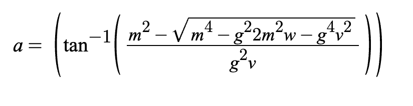

# Notes
## Collision Layers
- 1: ground
- 2: player
- 3: enemy detection
- 4: enemy collision
- 5: portals
- 6: weapons
## other things
- archer arrow drop:  

# Todo
## big things
- spikes/hazards
- boss
- size limit
- map 
- pogo
- overhaul random get stage because its weird rn
- spear can have charge or something idk (extend for long time because funny)
## small things/cool tidbits that aren't important **yet**
- transfer collisions to be on the player (as opposed to the enemy.gd script)
- allow enemies to collide (What?)
## fixes
- fix the weirdness of the portal system (goes together with making a map)
  - basically, the portals do link, but if there are 2 adjacent ones (that would connect via portal or one would block the other), they don't interact
- janky spear col (only butt now)
  - spear pull in at distances
- some weird slash bug? -> I still don't know what this is

# Questions to ask people
- file structure
  - do I need to do SubVP for what I'm doing
  - should I have multiple HUDS for each thing? -> HUD, stageSelect, pause
  - weapon has scrip
- general abstraction/layout questions
